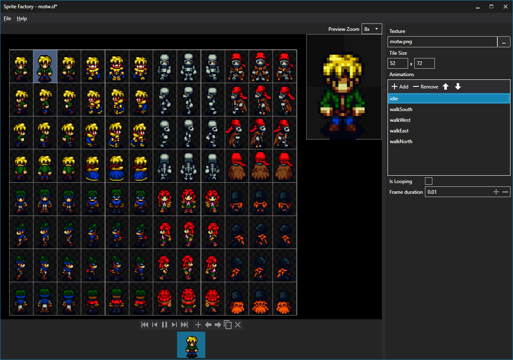
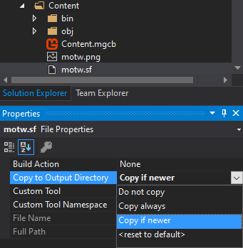
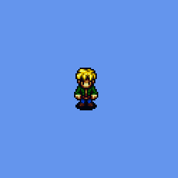

The MonoGame.Extended.Animations library contains classes useful for animating 2D sprite.

## Installation

[MonoGame.Extended.Animations](https://www.nuget.org/packages/MonoGame.Extended.Animations) is distributed via a NuGet package. You can add the NuGet package to your C# project through your IDE of choice (Visual Studio, Xamarin Studio, Rider, etc) or through the Command Line Interface (CLI) using the dotnet command.
```
dotnet add MonoGame.Extended.Entities
```


## Setup SpriteFactory

In this example we use SpriteFactory for animating Sprites.
we are going to build it ourselves from the source.

**Step 1 clone the SpriteFactory repository**

`git clone https://github.com/craftworkgames/SpriteFactory.git`

**Step 2 Build and run**

`cd SpriteFactory`

`dotnet run --project SpriteFactory`

## Usage

### Creating the Animation

:::info
The assets used in this example can be downloaded [here](./assets.zip)
:::

Before we can load an animation, we must first animate it in SpriteFactory.
We are using the `mowt.png` from the assets

**Step 1**
Create new project in `File -> New`

**Step 2**
Open mowt.png in `Texture`

**Step 3**
Set Tile Size to 52 by 72 pixels

**Step 4**
Add your animations and configure your prefered Frame duration



Next we save our animation as `mowt.sf`

### ContentPipeline

SpriteFactory animation does not have to be imported with the ContentPipeline
But we de need to tell the compiler to copy `mowt.sf` to the output folder.
In visual studio you can do that by clicking on `mowt.sf` in the Solution Explorer and setting  `Copy to Output Directorty` to `Copy if newer`.



You can also set this in your `project.csproj` by adding the following

```xml
<ItemGroup>
    <None Update="Content\motw.sf">
      <CopyToOutputDirectory>PreserveNewest</CopyToOutputDirectory>
    </None>
</ItemGroup>
```

`motw.png` can just be imported as Texture2D.

### Loading the Animation

We start by defining our fields
```csharp
private AnimatedSprite _motwSprite;
private Vector2 _motwPosition;
```

Next we load the content

To use `new JsonContentLoader()` you need to use the `Content.Load extension`
```cs
using MonoGame.Extended.Content;
```

```csharp
protected override void LoadContent()
{
    _spriteBatch = new SpriteBatch(GraphicsDevice);
    var spriteSheet = Content.Load<SpriteSheet>("motw.sf", new JsonContentLoader());
    var sprite = new AnimatedSprite(spriteSheet);
    
    sprite.Play("idle");
    _motwPosition = new Vector2(100, 100);
    _motwSprite = sprite;
}
```

### Updating the Animation

We use the following code to update the Position and Animation of the Player.

```csharp
protected override void Update(GameTime gameTime)
{
    var deltaSeconds = (float)gameTime.ElapsedGameTime.TotalSeconds;
    var walkSpeed = deltaSeconds * 128;
    var keyboardState = Keyboard.GetState();
    var animation = "idle";

    if (keyboardState.IsKeyDown(Keys.W) || keyboardState.IsKeyDown(Keys.Up))
    {
        animation = "walkNorth";
        _motwPosition.Y -= walkSpeed;
    }

    if (keyboardState.IsKeyDown(Keys.S) || keyboardState.IsKeyDown(Keys.Down))
    {
        animation = "walkSouth";
        _motwPosition.Y += walkSpeed;
    }

    if (keyboardState.IsKeyDown(Keys.A) || keyboardState.IsKeyDown(Keys.Left))
    {
        animation = "walkWest";
        _motwPosition.X -= walkSpeed;
    }

    if (keyboardState.IsKeyDown(Keys.D) || keyboardState.IsKeyDown(Keys.Right))
    {
        animation = "walkEast";
        _motwPosition.X += walkSpeed;
    }

    _motwSprite.Play(animation);

    if (keyboardState.IsKeyDown(Keys.R))
        Camera.ZoomIn(deltaSeconds);

    if (keyboardState.IsKeyDown(Keys.F))
        Camera.ZoomOut(deltaSeconds);

    _motwSprite.Update(deltaSeconds);


    base.Update(gameTime);
}
```

### Drawing the final result

```csharp
protected override void Draw(GameTime gameTime)
{
    GraphicsDevice.Clear(Color.CornflowerBlue);

    _spriteBatch.Begin(samplerState: SamplerState.PointClamp);
    _spriteBatch.Draw(_motwSprite, _motwPosition);
    _spriteBatch.End();

    base.Draw(gameTime);
}
```

## Result

