MonoGame.Extended.Particles is ported from the Mercury Particle Engine.
A particle engine helps you simulate phenomena, which are otherwise very hard to reproduce with conventional rendering techniques. examples include replicating fire, explosions, smoke, moving water, sparks.

## Installation

[MonoGame.Extended.Particles](https://www.nuget.org/packages/MonoGame.Extended.Particles) is distributed via a NuGet package. You can add the NuGet package to your C# project through your IDE of choice (Visual Studio, Xamarin Studio, Rider, etc) or through the Command Line Interface (CLI) using the dotnet command.
```
dotnet add package MonoGame.Extended.Particles
```

## Quick start

We start by including the required namespaces.

```cs
using MonoGame.Extended;
using MonoGame.Extended.Particles;
using MonoGame.Extended.Particles.Modifiers;
using MonoGame.Extended.Particles.Modifiers.Containers;
using MonoGame.Extended.Particles.Modifiers.Interpolators;
using MonoGame.Extended.Particles.Profiles;
using MonoGame.Extended.TextureAtlases;
```

Next, we declare our `ParticleEffect` and `Texture2D` fields

```cs
private ParticleEffect _particleEffect;
private Texture2D _particleTexture;
```

Which we assign in the `LoadContent` function

```cs
_particleTexture = new Texture2D(GraphicsDevice, 1, 1);
_particleTexture.SetData(new[] { Color.White });

TextureRegion2D textureRegion = new TextureRegion2D(_particleTexture);
_particleEffect = new ParticleEffect(autoTrigger: false)
{
    Position = new Vector2(400, 240),
    Emitters = new List<ParticleEmitter>
    {
        new ParticleEmitter(textureRegion, 500, TimeSpan.FromSeconds(2.5),
            Profile.BoxUniform(100,250))
        {
            Parameters = new ParticleReleaseParameters
            {
                Speed = new Range<float>(0f, 50f),
                Quantity = 3,
                Rotation = new Range<float>(-1f, 1f),
                Scale = new Range<float>(3.0f, 4.0f)
            },
            Modifiers =
            {
                new AgeModifier
                {
                    Interpolators =
                    {
                        new ColorInterpolator
                        {
                            StartValue = new HslColor(0.33f, 0.5f, 0.5f),
                            EndValue = new HslColor(0.5f, 0.9f, 1.0f)
                        }
                    }
                },
                new RotationModifier {RotationRate = -2.1f},
                new RectangleContainerModifier {Width = 800, Height = 480},
                new LinearGravityModifier {Direction = -Vector2.UnitY, Strength = 30f},
            }
        }
    }
};
```

Since `_particleTexture` and `_particleEffect` are not loaded with the `ContentManager`, we need to dispose them in `UnloadContent`.

```cs
_particleTexture.Dispose();
_particleEffect.Dispose();
```

Finaly, we add implement `Update` and `Draw`
```cs
protected override void Update(GameTime gameTime)
{
    _particleEffect.Update((float)gameTime.ElapsedGameTime.TotalSeconds);
    base.Update(gameTime);
}

protected override void Draw(GameTime gameTime)
{
    GraphicsDevice.Clear(Color.Black);

    _spriteBatch.Begin(blendState: BlendState.AlphaBlend);
    _spriteBatch.Draw(_particleEffect);
    _spriteBatch.End();

    base.Draw(gameTime);
}
```

## Profiles

Profiles determine how the particles are distributed

### CircleProfile
The Circle profile distributes the particles within a circle

#### `CircleRadiation`
Determines the heading direction of the particles

**Code**

```cs
Profile.Circle(150, Profile.CircleRadiation.In)
```


### PointProfile
The Point profile distributes the particles at the same point

**Code**

```cs
Profile.Point()
```
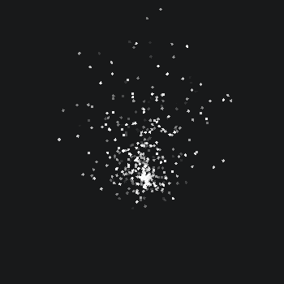

### BoxProfile
The Box profile distributes the particles over the edge of a box

:::note
The box profile distributed 25% of the particle on each edge.
If you have a rectangular shape and you want an even distribution, use the BoxUniform profile
:::

**Code**

```cs
Profile.Box(150,150)
```
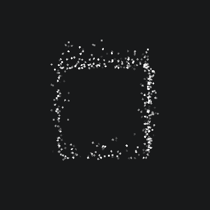


### BoxUniformProfile
The BoxUniform profile evenly distributes the particles over the edge of a box

**Code**

```cs
Profile.BoxUniform(150,300)
```


### BoxFillProfile
The BoxFill profile distributes the particles within a box

**Code**

```cs
Profile.BoxFill(150,150)
```


### LineProfile
The Line profile distributes the particles over a line

**Code**

```cs
Profile.Line(new Vector2(1,1), 150)
```


### RingProfile
The Ring profile distributes the particles over a line

#### `CircleRadiation`
Determines the heading direction of the particles

**Code**

```cs
Profile.Ring(150, Profile.CircleRadiation.In)
```
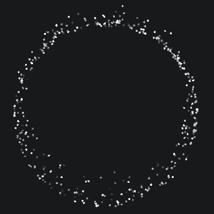

### SprayProfile
The Spray profile prays the particles in a given direction

**Code**

```cs
Profile.Spray(new Vector2(1,1), 2f )
```


## Modifiers

### AgeModifier
The `AgeModifier` Uses Interpolators to modify the particle over its lifespan.

**Code**
```cs
new AgeModifier
{
    Interpolators =
    {
        new ColorInterpolator
        {
            StartValue = Color.Yellow.ToHsl(),
            EndValue = Color.Blue.ToHsl()
        }
    }
}
```
**Result**


### CircleContainerModifier

This Modifier makes the particles collide with a circle container.

#### `Radius`
The radius of the `CircleContainer`.

#### `Inside`
Whether the particles should stay inside the of outside the container

#### `RestitutionCoefficient`
The bounces back force of the particles

**Code**
```cs
new CircleContainerModifier()
{
    Radius = 50,
    Inside = true,
    RestitutionCoefficient = 0.2f
}
```
**Result**


### RectangleContainerModifier

This Modifier makes the particles collide with a rectangle container.


#### `Width`
Width of the container

#### `Height`
Height of the container

#### `RestitutionCoefficient`
The bounces back force of the particles

**Code**
```cs
new RectangleContainerModifier
{
    Width = 150,
    Height = 150,
    RestitutionCoefficient = 0.2f,
}
```
**Result**

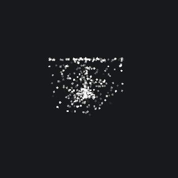

### RectangleLoopContainerModifier

This Modifier keeps the particles inside a rectangular container by looping them around.

#### `Width`
Width of the container

#### `Height`
Height of the container

**Code**
```cs
new RectangleLoopContainerModifier
{
    Width = 150,
    Height = 150
}
```
**Result**

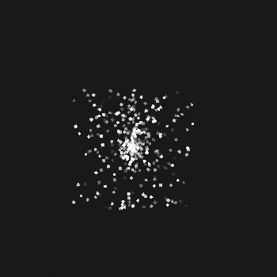


### DragModifier

The `DragModifier` simulates the effects of the particle passing through a medium such as water, air, etc., which exert a force (drag) which slows the particles down.

#### `DragCoefficient`
The drag coefficient of the particle.

#### `Density`
The density of the medium through which the particle is moving.

**Code**
```cs
new DragModifier
{
    Density = 1f, DragCoefficient = 1f
}
```

**Result**

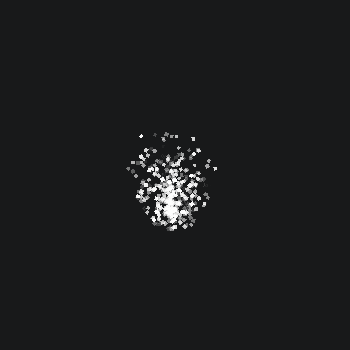

### LinearGravityModifier

`LinearGravityModifier` applies linear gravity to the particle

#### `Direction`
The direction of gravity.

#### `Strength`
Strength of the gravity

**Code**
```cs
new LinearGravityModifier
{
    Direction = new Vector2(0,-1), 
    Strength = 30f
}
```

**Result**


### OpacityFastFadeModifier

`OpacityFastFadeModifier` fades the particles over the span of their lifetime

**Code**
```cs
new OpacityFastFadeModifier()
```

**Result**

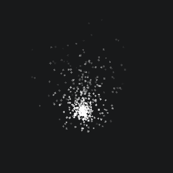

### RotationModifier

The `RotationModifier` rotates the particles by a given `RotationRate`

**Code**
```cs
new RotationModifier
{
    RotationRate = 5f
}
```

**Result**


### VelocityColorModifier

The `VelocityColorModifier` Colors the particle by its velocity

#### `StationaryColor`
The color when the velocity is 0

#### `VelocityColor`
The particle color when it reaches the VelocityThreshold

#### `VelocityThreshold`
The threshold of the velocity

**Code**
```cs
new VelocityColorModifier
{
    StationaryColor = Color.Green.ToHsl(),
    VelocityColor = Color.Blue.ToHsl(),
    VelocityThreshold = 80f
}
```

**Result**

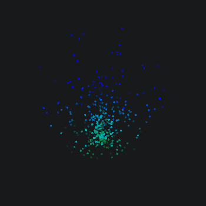

### VelocityModifier
The `VelocityModifier` Uses `Interpolators` to modify the particles depending on their velocity.

**Code**
```cs
new VelocityModifier()
{
    Interpolators =
    {
        new ColorInterpolator
        {
            StartValue = Color.Green.ToHsl(),
            EndValue = Color.Blue.ToHsl()
        }
    },
    VelocityThreshold = 80f
}
```
**Result**

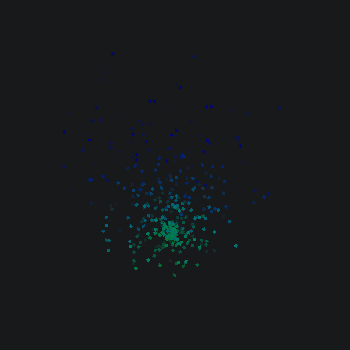


### VortexModifier
This `VortexModifier` moves the particles in a whirling vortex. This can be used for creating wind effects, etc.

#### `Mass`
The mass of the vortex

#### `Position`
The position of the vortex relative to the `ParticleEmitter`

**Code**
```cs
new VortexModifier()
{
    Mass = 10f,
    MaxSpeed = 1f,
    Position = new Vector2(0,-150)
},
new VortexModifier()
{
    Mass = 10f,
    MaxSpeed = 1f,
    Position = new Vector2(-150,0)
}
```
**Result**

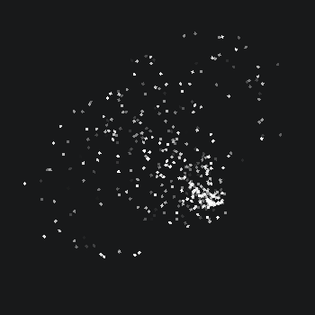


## Interpolators

Interpolators are used by `AgeModifier` and `VelocityModifier` to interpolate particle properties

### ColorInterpolator
The `ColorInterpolator` Interpolates from a Start to an End color.

**Code**
```cs
new AgeModifier
{
    Interpolators =
    {
        new ColorInterpolator
        {
            StartValue = Color.Yellow.ToHsl(),
            EndValue = Color.Blue.ToHsl()
        }
    }
}
```
**Result**

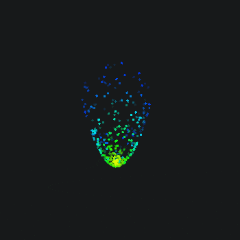

### HueInterpolator
The `HueInterpolator` Interpolates from a Start to an End Hue.

:::note
Make sure to set the particle color
:::

**Code**
```cs
new AgeModifier()
{
    Interpolators = new List<Interpolator>()
    {
        new HueInterpolator { StartValue = 0f, EndValue = 360f }
    }
}
```
**Result**

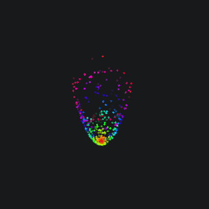

### OpacityInterpolator
The `OpacityInterpolator` Interpolates from a Start to an End Opacity.

**Code**
```cs
new AgeModifier()
{
    Interpolators = new List<Interpolator>()
    {
        new OpacityInterpolator { StartValue = -2f, EndValue = 1f }
    }
}
```
**Result**


### RotationInterpolator
The `RotationInterpolator` Interpolates from a Start to an End Rotation.

**Code**
```cs
new AgeModifier()
{
    Interpolators = new List<Interpolator>()
    {
        new RotationInterpolator { StartValue = 0f, EndValue = 5f }
    }
}
```
**Result**

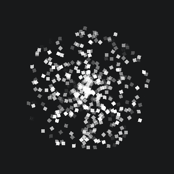


### ScaleInterpolator
The `ScaleInterpolator` Interpolates from a Start to an End Scale.

**Code**
```cs
new AgeModifier()
{
    Interpolators = new List<Interpolator>()
    {
        new ScaleInterpolator { StartValue = new Vector2(1,1), EndValue = new Vector2(10,10) }
    }
}
```
**Result**

