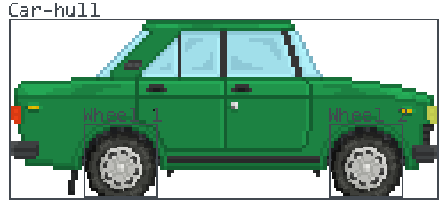

The `SceneGraph` is used to manage the spatial representation of objects. It is a tree structure in which the transformations of the parent nodes are applied to the child nodes.

### Car `SceneGraph`


### Diagram


## Installation

The `SceneGraphs` are available in the `MonoGame.Extended.SceneGraphs` library.
[MonoGame.Extended.SceneGraphs](https://www.nuget.org/packages/MonoGame.Extended.SceneGraphs) is distributed via a NuGet package. You can add the NuGet package to your C# project through your IDE of choice (Visual Studio, Xamarin Studio, Rider, etc) or through the Command Line Interface (CLI) using the dotnet command.
```
dotnet add package MonoGame.Extended.SceneGraphs
```

## Usage

The assets used in this example can be downloaded [here](./assets.zip)

We start by including the required namespaces.

```cs
using MonoGame.Extended;
using MonoGame.Extended.SceneGraphs;
using MonoGame.Extended.Sprites;
using MonoGame.Extended.ViewportAdapters;
```

Next, we declare our `SceneGraph` and The `SceneNodes`

```cs
private SceneNode _carNode;
private SceneNode _hoveredNode;
private SceneNode _leftWheelNode;
private SceneNode _rightWheelNode;
private SceneGraph _sceneGraph;
```

Which we initialize in the `LoadContent` function

```cs
_sceneGraph = new SceneGraph();

_carNode = new SceneNode("car-hull", GraphicsDevice.Viewport.Bounds.Center.ToVector2());

var carHullTexture = Content.Load<Texture2D>("car-hull");
var carHullSprite = new Sprite(carHullTexture);
_carNode.Entities.Add(new SpriteEntity(carHullSprite));

var carWheelTexture = Content.Load<Texture2D>("car-wheel");
var carWheelSprite = new Sprite(carWheelTexture);

_leftWheelNode = new SceneNode("left-wheel", new Vector2(-29, 17));
_leftWheelNode.Entities.Add(new SpriteEntity(carWheelSprite));

_rightWheelNode = new SceneNode("right-wheel", new Vector2(40, 17));
_rightWheelNode.Entities.Add(new SpriteEntity(carWheelSprite));

_carNode.Children.Add(_rightWheelNode);
_carNode.Children.Add(_leftWheelNode);
_sceneGraph.RootNode.Children.Add(_carNode);
```

### Updating

First we declare a `_speed` field that is used to update the `SceneGraph`
```cs
private float _speed = 0.15f;
```

Then, we add the following code to the `Update` function to update the potition of the Car and the rotation of the Wheels

```cs
var keyboardState = Keyboard.GetState();
var mouseState = Mouse.GetState();

if (keyboardState.IsKeyDown(Keys.W))
    _speed += (float)gameTime.ElapsedGameTime.TotalSeconds * 0.5f;

if (keyboardState.IsKeyDown(Keys.S))
    _speed -= (float)gameTime.ElapsedGameTime.TotalSeconds * 0.5f;

_leftWheelNode.Rotation += _speed;
_rightWheelNode.Rotation = _leftWheelNode.Rotation;
_carNode.Position += new Vector2(_speed * 5, 0);
```

We check the collision detection of the car in the following way

```cs
const int maxX = 535;
if (_carNode.Position.X >= maxX)
{
    _speed = -_speed * 0.2f;
    _carNode.Position = new Vector2(maxX, _carNode.Position.Y);
}
const int minX = 265;
if (_carNode.Position.X <= minX)
{
    _speed = -_speed * 0.2f;
    _carNode.Position = new Vector2(minX, _carNode.Position.Y);
}
```

### Drawing
We use the following code in our Draw function to draw the `SceneGraph` and collision walls

```cs
GraphicsDevice.Clear(Color.CornflowerBlue);

_spriteBatch.Begin(samplerState: SamplerState.PointClamp);

_spriteBatch.Draw(_sceneGraph);
_spriteBatch.FillRectangle(0, 266, 800, 240, Color.DarkOliveGreen);
_spriteBatch.FillRectangle(200, 0, 5, 480, Color.DarkOliveGreen);
_spriteBatch.FillRectangle(595, 0, 5, 480, Color.DarkOliveGreen);

_spriteBatch.End();
```

### Getting `SceneNode` at position

First we create a field `_hoveredNode` in which we store the Node.

```cs
private SceneNode _hoveredNode;
```

Which we then assign in the `Update` function
```cs
_hoveredNode = _sceneGraph.GetSceneNodeAt(new Vector2(mouseState.X, mouseState.Y));
```

Finally, We add the following code between `_spriteBatch` `Begin` and `End` to draw it

```cs
if (_hoveredNode != null)
{
    var boundingRectangle = _hoveredNode.BoundingRectangle;
    _spriteBatch.DrawRectangle(boundingRectangle, Color.Black);
    _spriteBatch.DrawString(_bitmapFont, _hoveredNode.Name, new Vector2(14, 2), Color.White);
}
```